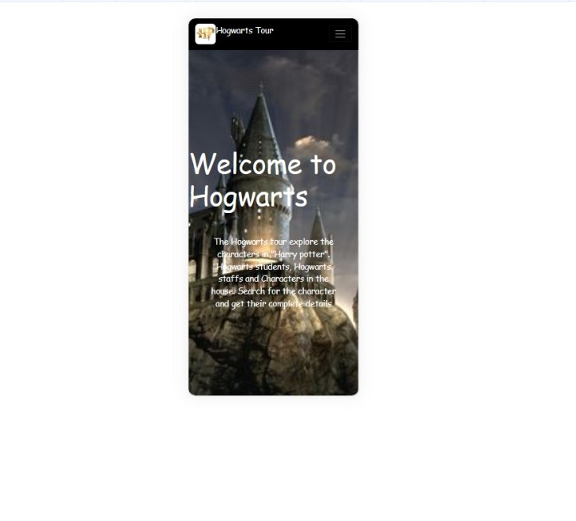
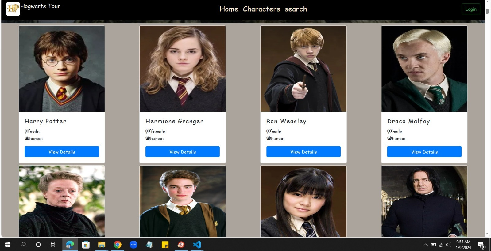
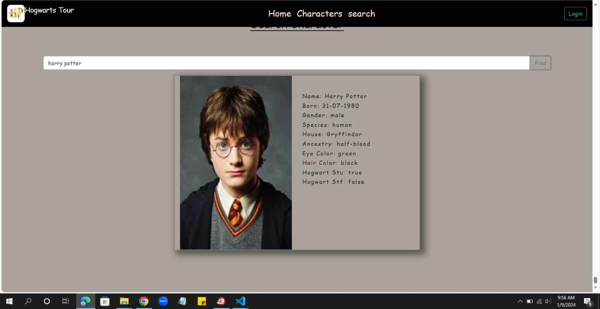

<h1>Hogwart Tour</h1>

  <h3>DOM: </h3>Created important HTML elements using DOM.
  <h3>Harry-potter api give all character info:</h3>Used (asyn&await) and fetch method to get the data response from the all countries in rest api.
<h3>Async & await</h3> 
async ad await method used to wait for the fetch() process to end and used that response as input to the next process.
when using await in async function it wont go next process until that it doesn't go for another process

<h3>Learned & Used</h3>
<ul>
    <li>Async and await </li>
    <li>DOM nested elements creation</li>
    <li>Css properties</li>
    <li>Glass morphisom</li>
    <li>click events</li>
    <li>Bootstrap Responsives</li>
  </ul>
<h2>And my output will be with responsivnes</h2>

